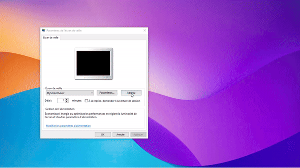
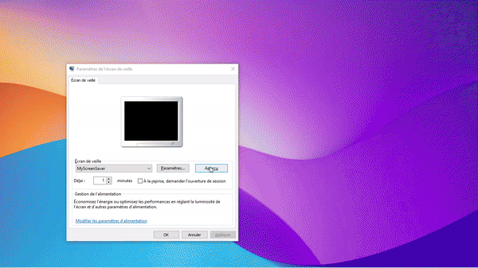

# Company Notification App

## Description

The Company Notification App is an innovative solution designed to enhance internal communication within companies. This app combines the power of Electron, Express, React, and .NET technologies to deliver seamless notifications and dynamic content to employees.

Key features of the app include:
- Running an Express web server inside the Electron app, serving internal localhost on port 3001 for the client and 3031 for the admin app.
- Exposing the web API to a built React interface.
- A screensaver .NET app that displays a customizable dynamic link for each company and a logo splash on startup.
- Separate repositories for the client-side app and the admin-side app, both containing a Chrome extension that sets the default browser link to localhost:3000.
- Windows notifications for new tasks, events, urgencies, and products.
- Integration with Inno Setup to use the screensaver as the default screensaver upon installation.

## Table of Contents

- [Quick Start](#quick-start)
- [Installation](#installation)
- [Usage](#usage)
- [Features](#features)
- [GIFs](#gifs)
- [Contributing](#contributing)
- [License](#license)

## Quick Start

To quickly start using the Company Notification App, simply download the .exe files for both the admin and client apps from the releases page and install them on your machine.

1. [Download the Admin App](link-to-admin-app-exe)
2. [Download the Client App](https://drive.google.com/file/d/1mUPJfq0jh_d2vMKPdQTqFM0EVlM-A--w/view?usp=drive_link)
3. Run the installers and follow the on-screen instructions.

## Installation

For manual setup and development purposes, follow the steps below:

### Client Side App

1. Clone the repository
    ```bash
    git clone https://github.com/louamlemjid/notification-company-electron.git
    ```
2. Navigate to the project directory
    ```bash
    cd companyNotificationApp
    ```
3. Install dependencies
    ```bash
    npm install
    ```
4. Start the project
    ```bash
    npm run dev
    ```

### Admin Side App

1. Clone the repository
    ```bash
    git clone https://github.com/louamlemjid/admin-company-notification-app.git
    ```
2. Navigate to the project directory
    ```bash
    cd admin-notification-company-electron
    ```
3. Install dependencies
    ```bash
    npm install
    ```
4. Start the project
    ```bash
    npm run dev
    ```

## Usage

1. Open the Electron app.
2. Navigate to the dashboard.
3. Manage tasks, events, urgencies, and products through the admin interface.
4. Employees receive notifications and updates via the client interface.
5. The screensaver displays the company's dynamic link and logo splash on startup.

## Features

- **Express Web Server**: Runs inside the Electron app, serving internal localhost for client and admin interfaces.
- **React Interface**: Exposes the web API to a built React interface.
- **Customizable Screensaver**: .NET app form that runs a dynamic link customizable for each company and displays the logo splash on startup.
- **Chrome Extension**: Sets the default browser link to localhost:3000 and new tab default link to localhost:3000.
- **Windows Notifications**: Notifies employees of new tasks, events, urgencies, and products.
- **Inno Setup Integration**: Uses the screensaver as the default screensaver upon installation.

## GIFs

### Screensaver Demo


### React Interface for Employees


### Background Company Remover


## Contributing

1. Fork the repository.
2. Create a new branch (`git checkout -b feature-branch`).
3. Make your changes.
4. Commit your changes (`git commit -m 'Add some feature'`).
5. Push to the branch (`git push origin feature-branch`).
6. Open a pull request.

## License

This project is licensed under the MIT License - see the [LICENSE](LICENSE) file for details.
